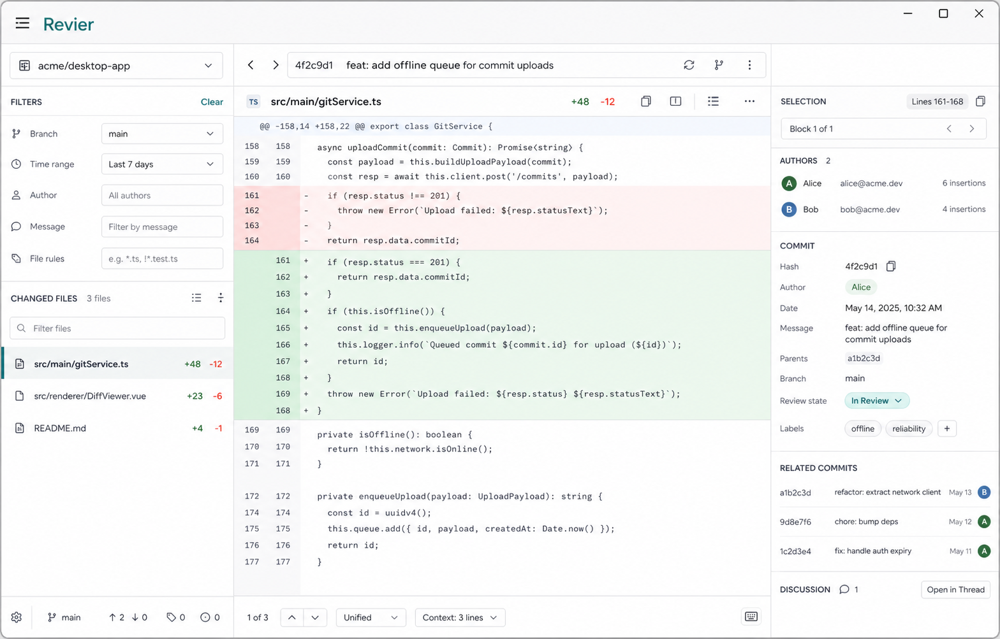

# Revier MVP 视觉方案

> 状态：已确认为实施参考。本文用于约束后续项目管理页和 Review 工作台的视觉方向。当前方案基于本轮生成的主工作台概念图整理，前端实现时以本文的结构、密度、配色和组件规则为准。



## 视觉定位

Revier 是面向开发者的代码 review 辅助工具，界面应当是安静、可靠、密集但可读的桌面生产力工具，而不是营销型产品页。

关键词：

- 工具型
- 低噪音
- 信息密度中高
- 代码优先
- 明确的筛选和任务状态
- 对比清晰的 diff 阅读体验

避免：

- 大 hero、营销文案、装饰插画
- 大面积紫色/蓝紫渐变
- 米色、奶油色、复古纸张感主题
- 过度圆角和层层嵌套卡片
- 假图表、装饰性指标、无意义徽章

## 主工作台布局

Review 工作台使用三栏布局：

- 左栏：仓库、筛选器、变更文件列表。
- 中栏：side-by-side diff 主阅读区。
- 右栏：选中变更块详情，包括作者、相关提交和命中筛选标记。

建议尺寸：

- 左栏：`300px` 到 `340px`。
- 右栏：`300px` 到 `340px`。
- 中栏：占据剩余宽度。
- 桌面最小宽度：`1024px`。
- 默认窗口：约 `1280x820` 或更宽。

布局规则：

- 三栏高度占满窗口。
- 左右栏独立滚动。
- 中栏 diff 区独立滚动。
- 面板之间用 `1px` 浅灰边框分隔。
- 不使用外层大卡片包裹整个页面。

## 配色

基础色：

- 应用背景：`#f6f7f9`
- 面板背景：`#ffffff`
- 主文本：`#1f2937`
- 次级文本：`#6b7280`
- 弱文本：`#9ca3af`
- 边框：`#d7dbe2`
- 轻边框：`#eceff3`

强调色：

- 主强调：`#0f766e`
- 主强调 hover：`#115e59`
- 选中侧边条：`#0f766e`

Diff 色：

- 新增背景：`#e7f6ed`
- 新增强调：`#1f8a4c`
- 删除背景：`#fdeceb`
- 删除强调：`#d93025`
- 修改背景：`#eef5ff`

颜色使用规则：

- 红绿只用于 diff 语义，不用于普通装饰。
- teal 只用于当前选中、主按钮、焦点和少量状态。
- 不使用渐变背景和装饰光斑。

## 字体与排版

应用 UI 字体：

```css
font-family: Inter, ui-sans-serif, system-ui, -apple-system, BlinkMacSystemFont, "Segoe UI", sans-serif;
```

代码字体：

```css
font-family: "JetBrains Mono", "SFMono-Regular", Consolas, "Liberation Mono", monospace;
```

排版建议：

- 页面标题：`20px` / `600`
- 面板标题：`12px` / `600`，大写或短标签风格
- 表单标签：`12px` / `500`
- 普通 UI 文本：`13px` 到 `14px`
- 文件路径：`13px` / `500`
- 代码行：`13px`，行高 `22px`
- 右侧详情正文：`13px`

文字规则：

- 不使用负字距。
- 按钮、输入框、表格、侧栏项都显式定义字号。
- 长路径必须省略，不允许撑破布局。

## 项目页

项目页是启动后的第一屏，不做 landing page。

结构：

- 顶部：应用名 `Revier`，可放简洁操作区。
- 主区：项目列表。
- 上方或侧边：新增项目入口。

项目列表字段：

- 项目名
- 仓库路径
- 默认分支
- 默认时间范围
- 固定状态
- 最近打开时间
- 操作：打开、编辑偏好、移除记录

视觉规则：

- 使用表格或紧凑列表，不使用大卡片网格。
- 固定项目可以使用小图标或轻量标记。
- 路径使用等宽或半等宽视觉处理，保持可扫描。

## Review 工作台

### 左栏

顶部显示当前项目和仓库路径摘要。

筛选器顺序：

1. 分支
2. 时间范围
3. 作者
4. 提交信息
5. 文件规则
6. 分析按钮与任务状态

变更文件列表：

- 每行显示文件路径。
- rename 显示 `oldPath -> path`。
- 右侧显示 `+N -M`。
- 当前选中文件左侧显示 teal 色竖条。
- 二进制文件显示不可预览标记。

### 中栏

Diff 区默认 side-by-side：

- 左侧旧版本，右侧新版本。
- 行号列窄而稳定。
- 代码列等宽字体。
- 删除块使用淡红背景。
- 新增块使用淡绿背景。
- 修改行内部做词级高亮。
- 每个变更块旁显示作者 chips。

块交互：

- hover 时块背景略增强。
- 点击块后选中，并同步右栏详情。
- 选中块可以显示左边框或淡 teal 背景，不覆盖 diff 红绿语义。

### 右栏

右栏用于显示选中变更块详情：

- 顶部：选中行区间，例如 `Lines 161-168`。
- 作者区：作者头像/首字母、姓名、邮箱、贡献行数或提交数。
- 当前提交摘要：hash、作者、时间、标题、分支。
- 相关提交列表：短 hash、标题、时间、作者标记。
- 命中筛选的提交显示 `命中筛选` 标签。

右栏规则：

- 信息按区块分隔，但不用嵌套卡片。
- 提交列表使用紧凑行布局。
- 长提交标题最多两行。

## 组件规则

按钮：

- 主按钮用于“分析”“打开项目”。
- 次要操作使用文本按钮或轻量按钮。
- 图标优先使用 `lucide-vue-next`。

输入：

- 筛选输入使用固定高度。
- 多行 glob 规则使用 textarea。
- 时间选择器占满栏宽。

标签：

- 作者标签小尺寸。
- 命中筛选标签使用成功色或 teal。
- 二进制/不可预览使用中性色。

表格和列表：

- 使用浅边框分隔。
- 行高稳定。
- hover 只改变背景，不改变尺寸。

## 响应式策略

MVP 以桌面为主。

当窗口较窄时：

- 左栏保持最小宽度。
- 右栏可以折叠为抽屉或下方面板。
- diff 中栏保持横向滚动，不强行压缩代码。

移动端不是 MVP 目标，但不应出现明显文本重叠或布局崩坏。

## 概念图提示词摘要

本轮生成的概念图使用以下方向：

- 16:10 桌面应用截图。
- 浅色中性背景。
- 左侧筛选和变更文件。
- 中间 side-by-side diff。
- 右侧选中块详情。
- teal 作为主强调。
- 红绿 diff 高亮。
- 禁止营销 hero、装饰插画、渐变和卡片堆叠。

后续前端实现应把概念图作为布局和密度参考，但所有真实 UI 必须使用代码原生控件和真实交互状态实现。
