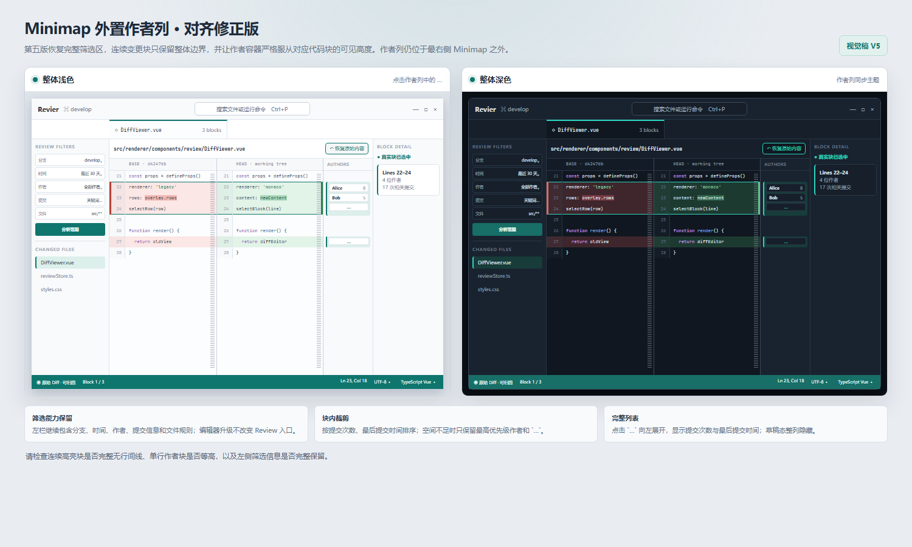

# Revier Monaco 可交互 Diff 编辑器设计

> **实现状态（2026-07-19）：已完成。** 最终实现与真实 Tauri 验收结果见
> [Monaco 编辑器最终验收记录](../verification/2026-07-19-revier-monaco-editor.md)。

> **后续修订（2026-07-20）：** 本文关于“Rust `DiffBlock` 是 UI 块边界事实来源”以及允许 Monaco/Rust
> 边界差异的内容，已由
> [Monaco 单一 Diff 块边界设计](./2026-07-20-revier-monaco-canonical-diff-design.md)取代；其余已验收的
> 编辑器、草稿、语言、编码、主题与布局设计继续有效。

> 状态：已确认。本文记录 Revier 将现有自绘 Diff 阅读区升级为 Monaco 原生 Diff Editor 的完整设计。本文是后续实施计划、测试与验收的唯一范围依据。

## 关联成果

- [最终视觉稿](./2026-07-16-revier-monaco-editor-visual.html)
- [最终视觉截图](./2026-07-16-revier-monaco-editor-visual.png)



## 背景

当前 `DiffViewer.vue` 使用 Vue 模板和 CSS Grid 渲染完整文件的 side-by-side Diff。它能够显示行号、红绿行背景、词级变化、作者标签和选中块，但代码区域不是真实编辑器：无法获得原生光标、选区、撤销栈、查找、折叠、括号匹配、Minimap 和命令面板，语法也没有按语言高亮。

本轮将中间 Diff 阅读区升级为可点击、可放置光标、左右均可临时编辑的 Monaco Diff Editor。所有编辑只存在于内存，不保存到仓库、项目配置或后端。用户切换上下文或关闭页面时直接销毁草稿。

## 目标

- 直接升级当前 side-by-side Diff，不新增独立编辑模式或覆盖页。
- 左右两侧都支持光标、选区、复制粘贴、临时编辑、撤销/重做、查找、括号匹配、折叠、Minimap 和命令面板。
- Monaco 根据临时编辑实时重新计算 Diff。
- 原始 Diff 状态继续支持真实变更块选择、作者标记和右侧归因。
- 首次修改后进入临时草稿状态，退出真实块交互与归因。
- 支持常用语言高亮、文件级临时语言切换和真实编码切换。
- 支持完整浅色与完整深色主题，不出现局部深浅拼接。
- 字体、颜色、主题和大文件阈值通过应用级 TOML 配置。
- 将作者信息移出代码区，使用紧邻 Monaco 最右侧的独立 `AuthorRail`。
- 保留左栏全部筛选能力和右栏块详情能力。

## 非目标

- 不保存或导出用户的临时编辑。
- 不把 Revier 扩展为完整 IDE，不接入编译、调试、终端或项目级语言服务器。
- 不提供自动补全、诊断和代码修复的产品承诺；Monaco 自带的基础能力不作为本轮验收重点。
- 不新增设置页面；配置仅通过 `editor.toml` 修改，并在下次启动时生效。
- 不在临时草稿状态尝试把实时 Diff 映射回 Git 作者归因。
- 不维护旧版自绘 Diff 作为运行时回退路径。
- 不改变 Review 范围分析、提交筛选、索引和归因算法的产品语义。

## 已确认决策

| 事项 | 决策 |
| --- | --- |
| 编辑器形态 | 直接替换当前代码区域，使用 Monaco 原生 Diff Editor |
| 可编辑侧 | 左右两侧均可临时编辑 |
| 编辑结果 | 仅内存存在，永不保存 |
| Diff 行为 | 编辑后接受 Monaco 实时重新计算 |
| 草稿归因 | 草稿覆盖真实块交互层，不提供归因 |
| 配置作用域 | Tauri 应用级配置 |
| 配置格式 | TOML |
| 配置刷新 | 下次启动生效 |
| 主题 | 默认跟随系统，可强制浅色或深色 |
| 主题范围 | 整个 Revier 应用 |
| 字体回落 | `JetBrainsMono Nerd Font Mono` → `Microsoft YaHei` → `monospace` |
| 语言选择 | 扩展名自动识别，手动选择仅当前文件有效 |
| 编码 | 自动检测、UTF-8、GB18030、UTF-16 LE、UTF-16 BE |
| 大文件 | 超过 1 MiB 或 5000 行先确认 |
| 作者展示 | Minimap 右侧独立 AuthorRail |

## 技术方案比较

### 方案 A：两个独立 Monaco Editor

可以完全冻结后端 Diff 装饰，但需要自行实现左右对齐、滚动同步、空行占位和 Diff 行为。没有采用。

### 方案 B：Monaco 原生 Diff Editor

原生支持 side-by-side Diff、左右编辑、Minimap、折叠、查找和命令面板。它会在 Model 改变后实时重新计算 Diff，不能通过公开 API 注入或冻结自定义 Diff 结果。本轮采用此方案，并以明确的原始/草稿状态隔离 Git 归因语义。

### 方案 C：CodeMirror 6 MergeView

支持双编辑器和模块化语言扩展，但 Minimap、完整命令面板和 IDE 工具感需要更多自研。没有采用。

## 技术选型

- Vue 3 `<script setup>`：页面与组件状态。
- `monaco-editor`：原生 Diff Editor 和 IDE 交互能力。
- `shiki`、`@shikijs/monaco`：TextMate 语法高亮和 Vue/TOML 等语言支持。
- Vite Module Worker：Monaco Editor、TypeScript、JSON、CSS、HTML Worker。
- Pinia：继续保存真实 Overlay 和选中块；不保存临时文本。
- Tauri 2 Command：读取应用设置和按编码重新加载 Overlay。
- Rust `toml`：解析 `editor.toml`。
- Rust `encoding_rs`：解码 GB18030；UTF-8 与 UTF-16 使用标准能力。
- Vitest、Vue Test Utils、Cargo test：自动化测试。

前端直接封装 Monaco 公开 API，不引入 Vue Monaco 包装库。这样可以精确管理 Model、Worker、Disposable、Diff 子编辑器和外置 `AuthorRail`。

## 总体架构

```text
ReviewWorkspace / DiffDrilldownOverlay
                │
           DiffViewer.vue
   ┌────────────┼───────────────┐
工具栏与状态机   Monaco 适配层    真实块交互层
路径/草稿/恢复   Model/Worker     选择/作者/归因
                │                     │
     Monaco Native Diff Editor   DiffAuthorRail
                │                     │
        oldContent/newContent     DiffBlock 元数据

Renderer
   ├── NotificationCenter（会话内通知，不持久化）
   │ editor_settings_get / review_get_file_overlay
Tauri Commands
   ├── EditorSettingsService ── app_config_dir/editor.toml
   └── ReviewService ────────── revier-analysis
                                  ├── Git Blob 字节
                                  ├── 编码解码
                                  ├── Overlay Diff
                                  └── 作者统计与归因
```

## 前端模块划分

### `DiffViewer.vue`

- 保留文件标题、范围、块数量、加载、空状态和不可预览状态。
- 管理 `deferred`、`original`、`draft` 三种显示状态。
- 展示文件路径；仅在草稿状态展示“恢复原始内容”。
- 组合 `MonacoDiffSurface`、`DiffAuthorRail` 和 `EditorStatusBar`。
- 继续发出真实 `DiffBlock` 的 `selected` 事件。
- 新增 `draft-change` 事件，通知页面更新右栏状态。

### `MonacoDiffSurface.vue`

- 调用 `monaco.editor.createDiffEditor`。
- 设置 `originalEditable: true`，并保持修改侧可编辑。
- 为左右 Model 创建互不冲突的内存 URI。
- 管理创建、更新、重建、语言切换、主题切换和销毁。
- 暴露原始侧与修改侧的公开 `ICodeEditor` 引用给 AuthorRail 定位层。
- 监听首次用户内容变更并进入草稿状态。
- 使用公开 Decoration API 绘制真实块选中边界，不访问 Monaco 私有 DOM。

### `DiffAuthorRail.vue`

- 位于 Monaco 容器最右侧之后，固定宽度 `112px`。
- 根据真实 `DiffBlock`、编辑器公开位置 API 和当前视口生成作者容器。
- 负责作者排序、可见数量计算、`…` 和完整列表 Popover。
- 点击作者容器时选择对应真实块。
- 草稿状态不渲染。

### `EditorStatusBar.vue`

- 左侧显示原始/草稿状态和当前真实块序号。
- 右侧显示光标位置、编码和高亮语言。
- 编码和语言从点击位置向上展开选择列表。
- 编码切换触发 Overlay 重载；语言切换只更新当前两个 Model。

### `useEditorSettings.ts`

- 启动时读取 Tauri 返回的设置快照。
- 把字体列表转换为 Monaco/CSS 字体回落字符串。
- 监听系统浅深色变化。
- 把同一颜色配置应用到根节点 CSS 变量、Monaco Theme 和 Shiki Theme。

### `NotificationCenter.vue` 与 `useNotifications.ts`

- 各页面现有顶部操作区的右侧始终显示通知铃铛；没有通知时仍可打开并展示空列表。
- 项目页把铃铛放在“刷新”“打开项目”左侧并依次排列；Review 页把铃铛放在最右侧“详情”面板标题行右端。不得使用覆盖页面内容的 fixed 浮层，也不新增独立全局顶栏。
- 通知分为 `info`、`warning`、`error`，统一承接配置读取、Shiki 语言降级、Monaco 初始化以及后续运行时消息。
- 通知仅保存在当前运行会话的内存中，最多保留 100 条，重启后清空，绝不写入 `editor.toml` 或其他持久化存储。
- 列表按时间从新到旧排列并支持滚动；打开面板时把当前通知标记为已读，但保留历史记录。
- 支持删除单条和清空全部。
- 铃铛始终可见；仅存在未读通知时在按钮右下角显示红色数量徽标，1 至 99 显示实际数量，超过 99 显示 `99+`。
- 点击铃铛从所在页面的右上操作区向下展开通知列表；配置与运行时警告不再占用顶部横幅或编辑器状态栏。

### `editorLanguages.ts`

- 维护扩展名、文件名与 Monaco/Shiki 语言 ID 的映射。
- 只加载已确认语言的语法资源。
- 语言加载失败时返回纯文本模式，并把非阻断警告送入全局通知中心。

## 后端模块划分

### `EditorSettingsService`

- 路径：`app.path().app_config_dir()?.join("editor.toml")`。
- 文件缺失时写入默认配置。
- 启动时解析并验证一次。
- 配置损坏时不覆盖用户文件，返回内置默认值、配置路径和警告。

### 编码解码模块

- 接收 Git Blob 原始字节和请求编码。
- `auto` 依次判断 UTF-8 BOM、UTF-16 BOM 和合法 UTF-8。
- `auto` 无法可靠识别时返回明确错误，不猜测 GB18030。
- 手动选择 GB18030、UTF-16 LE 或 UTF-16 BE 时按指定编码解码。
- 解码后的文本进入现有 Overlay 和归因流程。

### 作者统计聚合

- 由 Rust 按规范化邮箱或姓名合并作者身份。
- 为每个块生成 `commitCount` 和 `lastCommittedAt`。
- 前端不重复推断身份或统计提交。

## 数据契约

### `FileOverlay`

```ts
interface FileOverlay {
  // 现有字段保持不变
  oldContent: string;
  newContent: string;
  resolvedEncoding: ResolvedTextEncoding;
}
```

`oldContent` 与 `newContent` 保留完整文本、换行风格、文件末尾换行和空文件语义。现有 `rows`、`blocks` 继续作为真实块和归因来源。

### `FileOverlayRequest`

```ts
type ResolvedTextEncoding = 'utf-8' | 'gb18030' | 'utf-16le' | 'utf-16be';
type TextEncoding = 'auto' | ResolvedTextEncoding;

interface FileOverlayRequest {
  taskId: string;
  filePath: string;
  encoding?: TextEncoding;
}
```

### `AuthorSummary`

```ts
interface AuthorSummary {
  name: string;
  email?: string;
  commitCount: number;
  lastCommittedAt: string;
}
```

### 编辑器设置快照

```ts
interface EditorSettingsSnapshot {
  settings: EditorSettings;
  configPath: string;
  warning?: string;
}
```

新增 Tauri 命令：

```text
editor_settings_get -> EditorSettingsSnapshot
```

现有 `review_get_file_overlay` 命令继续使用，但请求增加 `encoding`。

## 状态机

```text
加载 Overlay
    │
    ├── 二进制/不可预览 ──> unsupported
    ├── 超过软限制 ───────> deferred
    └── 正常 ─────────────> original

deferred
    ├── 确认加载 ─────────> original
    └── 切换上下文 ───────> dispose

original
    ├── 首次用户输入 ─────> draft
    ├── 切换编码成功 ─────> 重建 original
    └── 切换上下文 ───────> dispose

draft
    ├── 恢复原始内容 ─────> 销毁并重建 original
    ├── 切换编码成功 ─────> 销毁并重建 original
    └── 切换文件/提交/页面 > dispose
```

切换编码时先请求新 Overlay。请求成功后才销毁当前 Model；请求失败则保留当前内容并显示错误。

## 原始 Diff 数据流

1. `ReviewWorkspace` 请求指定文件的 `FileOverlay`。
2. Rust 读取两个提交对应的 Git Blob 字节。
3. Rust 按请求编码解码并生成完整文本、行级 Overlay、真实块和归因。
4. `DiffViewer` 使用 `oldContent` 和 `newContent` 创建 Monaco Model。
5. Monaco 原生 Diff Editor 计算并渲染 side-by-side Diff。
6. 点击事件按“侧别 + 行号”匹配 `DiffBlock.oldStart/oldEnd` 或 `newStart/newEnd`。
7. 页面把选中块写入 `reviewStore.selectedBlock` 并更新右栏。
8. `DiffAuthorRail` 根据同一块的可见位置显示排序后的作者。

Rust `DiffBlock` 是块选择与归因的事实来源；Monaco 原生 Diff 是代码视觉与临时编辑的事实来源。两者不互相覆盖语义。

## 草稿数据流

1. 任一 Model 首次发生用户输入。
2. `MonacoDiffSurface` 发出 `draft-change(true)`。
3. 页面清除 `reviewStore.selectedBlock`。
4. `DiffAuthorRail`、真实块 Decoration 和块点击响应全部退出。
5. 右栏显示“临时草稿不提供归因”。
6. Monaco 按当前两个 Model 自动重新计算实时 Diff。
7. “恢复原始内容”销毁两个 Model 并从当前 Overlay 重建，撤销栈同时清空。

临时文本、撤销栈和实时 Diff 不进入 Pinia、不经过 IPC、不写磁盘。

## 语言支持

首版最低范围：

- JavaScript、TypeScript、Vue
- HTML、CSS
- Rust、Python、Go、Java
- C、C++、C#
- SQL、Markdown、JSON、YAML、TOML
- Shell、PowerShell
- 纯文本

默认按文件扩展名或特殊文件名自动识别。手动选择同时作用于左右 Model，只对当前文件实例有效，切换文件后恢复自动识别。

## 编码行为

- 支持 `auto`、UTF-8、GB18030、UTF-16 LE、UTF-16 BE。
- `auto` 只使用 BOM 和合法 UTF-8 做确定性识别。
- 状态栏显示 `resolvedEncoding`，不是仅显示请求值。
- 用户手动选择编码时重新请求并重建 Overlay。
- 二进制文件不显示可用编码菜单。
- 草稿状态切换编码会在新 Overlay 成功后销毁草稿，不询问保存。

## TOML 配置规范

配置文件位于 Tauri 应用配置目录：

```text
<app_config_dir>/editor.toml
```

默认内容：

```toml
version = 1
theme = "system"
default_encoding = "auto"

[editor]
font_families = [
  "JetBrainsMono Nerd Font Mono",
  "Microsoft YaHei",
  "monospace",
]
font_size = 13
line_height = 22
minimap = true

[large_file]
max_bytes = 1048576
max_lines = 5000

[themes.light]
workspace_background = "#F4F6F8"
panel_background = "#FFFFFF"
editor_background = "#FCFDFE"
border = "#DFE5EC"
foreground = "#273448"
muted = "#768296"
accent = "#0F766E"
selection = "#DCEFEB"
diff_removed = "#FBE7E5"
diff_removed_strong = "#BC3D35"
diff_removed_word = "#F1B9B3"
diff_added = "#E2F3E8"
diff_added_strong = "#26804A"
diff_added_word = "#A9DBBB"

[themes.light.syntax]
comment = "#768296"
keyword = "#893CAD"
string = "#0B7952"
number = "#A05B00"
type = "#0969DA"
function = "#1C63A5"
variable = "#273448"

[themes.dark]
workspace_background = "#111821"
panel_background = "#161F2A"
editor_background = "#101720"
border = "#293645"
foreground = "#DCE3EC"
muted = "#94A1B3"
accent = "#2DD4BF"
selection = "#173C3A"
diff_removed = "#3E262C"
diff_removed_strong = "#E06B63"
diff_removed_word = "#743A43"
diff_added = "#1D3A30"
diff_added_strong = "#5EC58A"
diff_added_word = "#30664C"

[themes.dark.syntax]
comment = "#94A1B3"
keyword = "#D7A0F2"
string = "#8BD7AE"
number = "#EFB875"
type = "#82B7FF"
function = "#82B7FF"
variable = "#DCE3EC"
```

配置只在应用启动时读取。`theme = "system"` 时，启动后的系统主题变化仍会实时切换外观，因为颜色数据已经加载到内存；TOML 本身不会热重载。

## 主题规则

- `system`：跟随系统。
- `light`：强制完整浅色。
- `dark`：强制完整深色。
- 主题覆盖项目页、筛选区、文件列表、编辑器、AuthorRail、详情栏、弹层和状态栏。
- 应用 CSS、Monaco Theme 和 Shiki Theme 由同一份设置生成。
- 红绿只表示 Diff 语义；teal 表示选择、焦点和主状态。

## 编辑器视觉规则

- 左栏保留分支、时间、作者、提交信息、文件规则和变更文件列表。
- 顶部只显示文件路径；“恢复原始内容”仅在草稿状态出现。
- 文件类型和编码只在底部状态栏显示，不在顶部重复。
- Minimap 保留在左右编辑器最右侧，不提供顶部重复开关。
- 状态栏编码与语言可点击，并从点击位置向上展开。
- 窄窗口优先让 Monaco 横向滚动，不压缩 AuthorRail 文本。

### 真实块选中边界

- 旧侧使用深红外缘。
- 新侧使用深绿外缘。
- teal 只绘制块首上边界和块尾下边界。
- 中间行不绘制横线，整个多行块保持连续。

## AuthorRail 规则

### 布局

- 宽度固定为 `112px`。
- 作为 Monaco Diff Editor 的兄弟组件，不注入 Monaco 私有 DOM。
- 视觉上位于最右侧 Minimap/滚动条之后。
- 修改和新增块按修改侧行号定位；删除块按原始侧行号定位。

### 定位

- 使用 `getScrolledVisiblePosition`、`getTopForLineNumber` 和公开滚动/布局事件。
- 监听 `onDidScrollChange`、`onDidLayoutChange`、`onDidChangeHiddenAreas`。
- 使用 `requestAnimationFrame` 合并定位更新。
- 完全离开视口或被折叠的块不渲染作者容器。
- 作者容器高度严格等于代码块当前可见高度，不允许上下溢出。

### 排序与裁剪

作者顺序：

1. `commitCount` 降序。
2. `lastCommittedAt` 降序。
3. 姓名升序。

每个作者行高 `20px`、间距 `2px`。存在隐藏作者时预留一个 `20px` 的 `…` 按钮。单行块只能容纳 `…` 时不强行显示姓名。

点击 `…` 向左打开最大高度 `320px` 的 Popover，列表显示姓名、邮箱、提交次数和最后提交时间，超出后内部滚动。点击作者容器选择对应块；点击 `…` 只展开列表，不触发块切换。

草稿状态隐藏整个 AuthorRail，Monaco 自动占用释放的宽度。

## 大文件行为

- 比较 `oldContent`、`newContent` 中较大一侧。
- 超过 `max_bytes` 或 `max_lines` 时先显示确认界面。
- 用户确认后创建 Monaco，并启用其大文件优化。
- 用户取消时保留文件路径、大小和行数，不创建 Model。
- 二进制文件继续不可预览。

## 生命周期

以下情况必须销毁 Diff Editor、两个 Model、Decoration、Widget、Worker 订阅和所有 Disposable：

- 切换文件。
- 重新分析。
- 打开其他提交下钻。
- 关闭提交下钻。
- 离开 Review 工作台。
- 组件卸载。

销毁草稿时不弹保存确认。

## 异常处理

- TOML 缺失：创建默认文件。
- TOML 损坏或字段非法：保留原文件，使用内置默认值，并显示配置路径和字段错误。
- Monaco 或 Worker 初始化失败：显示错误和“重试加载”，不回退旧版渲染器。
- 单个语法加载失败：当前文件回退纯文本，其他能力保留。
- 编码解码失败：保留当前编辑器，显示错误；成功返回新 Overlay 后才替换。
- 作者统计异常：显示“未知作者”，不阻断 Diff。
- 系统主题变化：只更新 Theme，不重建 Model、不清空草稿。

## 测试设计

### Rust 单元测试

- 默认 TOML、完整 TOML、非法枚举、非法颜色、损坏文件。
- UTF-8/BOM、GB18030、UTF-16 LE/BE 解码。
- 无效字节、错误编码和二进制文件。
- `oldContent/newContent` 的换行、末尾换行和空文件。
- 作者提交次数、最后提交时间和稳定排序数据。

### 前端单元测试

- 扩展名到语言 ID 的映射。
- 字体回落字符串与浅深主题映射。
- 首次编辑进入草稿、清除选中块、隐藏 AuthorRail。
- 恢复、切换和卸载时销毁 Model。
- 编码切换成功替换、失败保留。
- 作者排序、块高度裁剪、`…` 和 Popover。
- 连续选中块只在首尾出现横向边界。
- 状态栏语言和编码菜单向上展开。

### Monaco 适配层测试

- Vitest mock Monaco 公开接口，验证 Model、事件和 Disposable 生命周期。
- AuthorRail 几何计算提取为纯函数测试。
- 真实 Worker、Minimap、折叠、滚动和主题使用 Tauri/Vite 页面进行浏览器验收。

现有测试逻辑如需修改，实施前必须按项目规则另行获得确认；新增测试不受此限制。

## 开发环境配置

- Shell：`pwsh`
- Node 管理：`fnm`
- Node：24.x
- 包管理：`pnpm 10.28.1`
- Rust：stable
- 新增 Node 依赖：使用 `pnpm add`
- 前端单元测试：`pnpm test`
- 类型检查：`pnpm typecheck`
- Lint：`pnpm lint`
- Rust 测试：`cargo test --workspace`
- 合同生成检查：`pnpm generate:bindings:check`

## 验收标准

- 左右侧都能放置光标并临时编辑。
- 支持撤销/重做、查找、括号匹配、折叠、Minimap 和命令面板。
- 临时文本不会写入任何持久化位置。
- 原始状态可选择真实块并查看作者归因。
- 草稿状态不显示真实块归因，退出上下文时直接销毁。
- AuthorRail 不遮挡代码，始终与块可见高度一致。
- 作者按提交次数、最后提交时间和姓名排序。
- `…` 能查看完整作者列表。
- 浅色与深色覆盖整个应用。
- 字体按指定顺序回落。
- 语言与编码状态栏选择真实生效。
- 大文件超过阈值时先确认。
- 生命周期结束后无遗留 Model、监听器或 Worker 引用。

## 风险与处理

| 风险 | 影响 | 处理 |
| --- | --- | --- |
| Monaco 原生 Diff 分块与 Rust 块边界不同 | 视觉分块和归因范围可能不完全一致 | Rust 范围负责选择与 AuthorRail，Monaco 负责代码视觉；使用固定夹具验证差异是否可接受 |
| 双可编辑 Model 占用内存较高 | 大文件卡顿 | 软限制、Monaco 大文件优化、严格销毁 |
| AuthorRail 滚动定位频繁 | 滚动抖动 | 只渲染可见块，并用 `requestAnimationFrame` 合并更新 |
| 折叠改变行坐标 | 作者块错位 | 监听隐藏区域与布局事件，完全折叠时隐藏 |
| Shiki 语言资源增加包体 | 启动和安装体积增加 | 只打包确认语言并按需加载 |
| 非 UTF-8 解码影响行级归因 | 错误编码会产生错误 Diff | 编码在 Rust 端统一应用于完整 Overlay 流程，失败不替换当前视图 |
| TOML 自定义颜色不完整 | Monaco 与外层颜色不一致 | 严格校验完整主题字段，缺失时整套回退默认主题 |

## 实施边界

本文只定义设计。实际开发必须在本文经用户审核后，使用 Superpowers `writing-plans` 生成逐步实施计划；实施计划未批准前不修改应用代码或测试逻辑。
